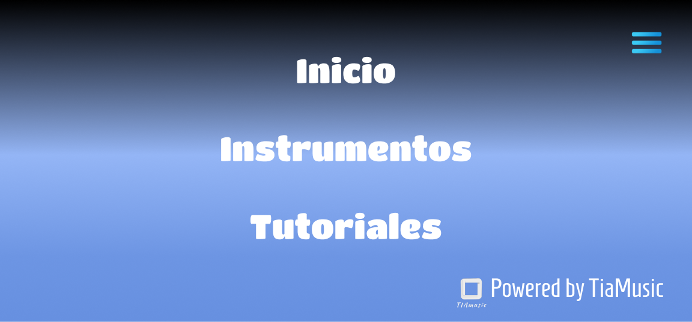
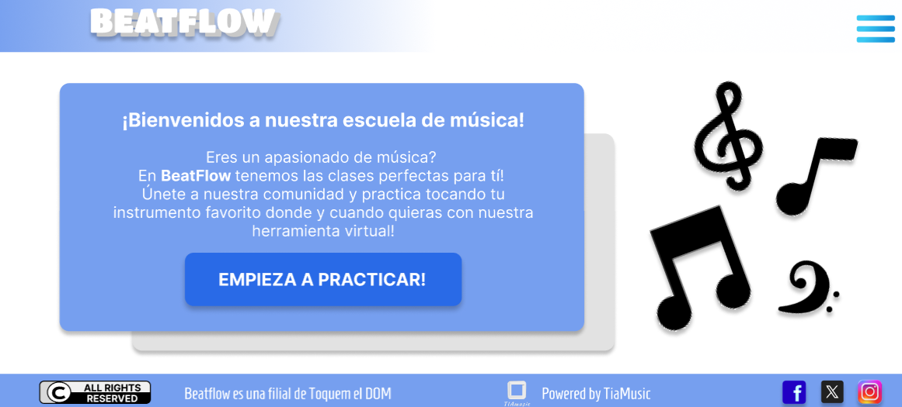
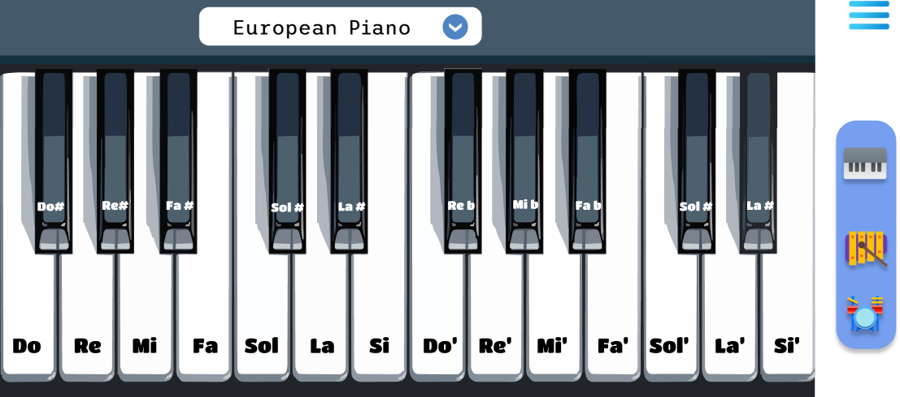
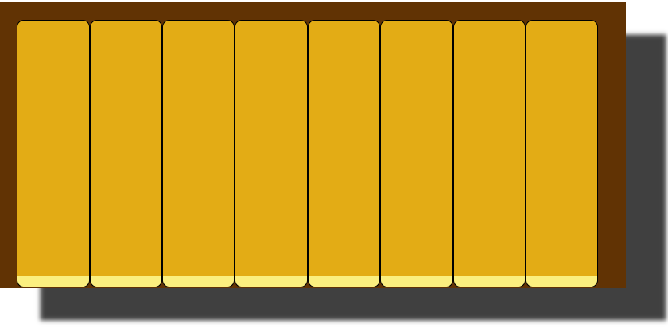
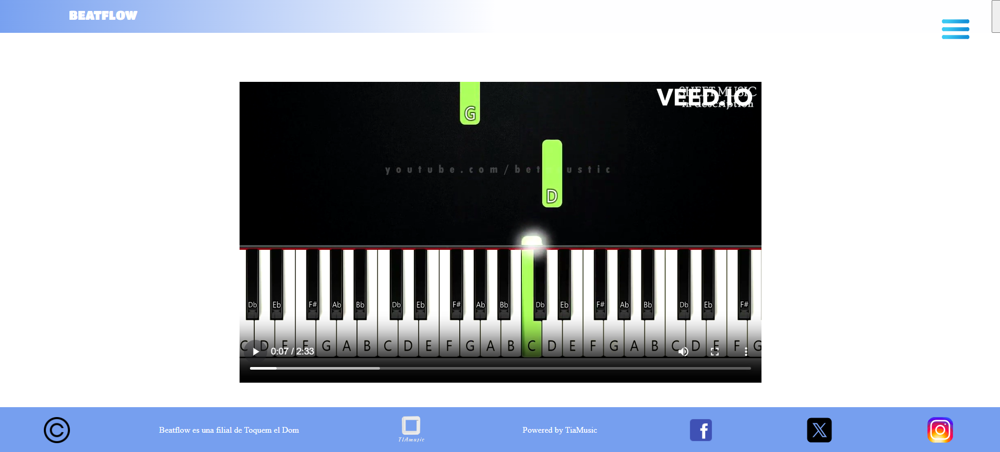
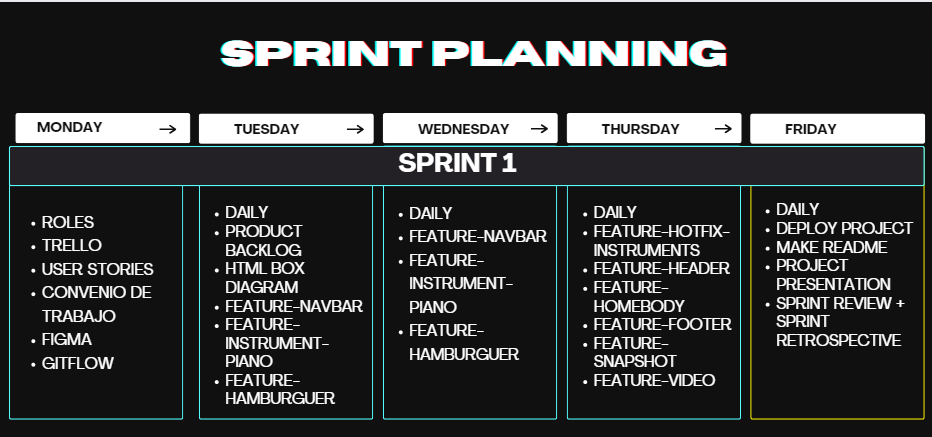
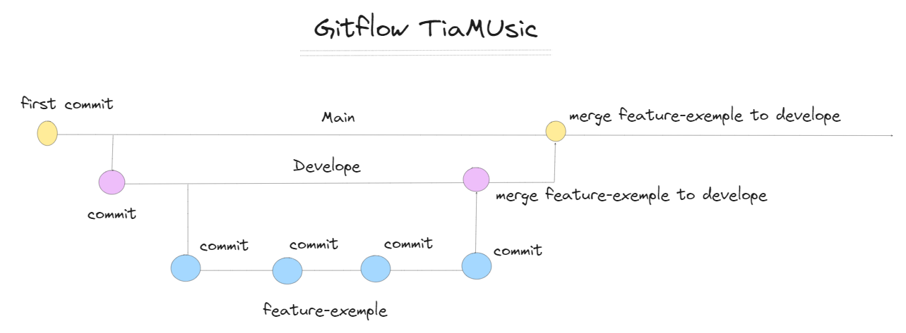

# Filial TOQUEN EL DOM ➡️ BeatFlow
El proyecto consiste en realizar una web para la filial BeatFlow de la escuela de música Toquen el Dom.
En la web, los alumnos van a poder practicar con un piano y marimba virtual haciendo click con el mouse en el instrumento y/o tocando el teclado del ordenador.

# PREVIEW







# DISEÑO

Para el diseño del mockup hemos utilizado la herramienta Figma.

Para visualizar la página haz click [AQUÍ](https://www.figma.com/file/wWeKgB4WPdsoLtUspmt9t7/TAImusic?type=design&node-id=0-1&mode=design&t=hzlvbZvN6hISVSwh-0)


# METODOLOGÍA DE TRABAJO
Hemos utilizado la metodología Agile junto con el marco de trabajo SCRUM.
En este primer sprint, hemos dividido el proyecto en features y posteriormente hemos consensuado su priorización con nuestras 2 stakeholders Cris Mouta y Rocío Cejudo.
Gracias a ello hemos podido refinar el product backlog y dividir las tareas por días de forma priorizada.



Utilizamos también la metodología Kanban con un Kanbanboard para organizarnos e trabajo

Aquí dejamos el enlace al Trello donde hemos

# FLUJO DE TRABAJO
Para controlar las diferentes versiones y avance del proyecto hemos utilizado la metodología GitFlow distribuyendo el trabajo en diferentes ramas.



# TECNOLOGÍAS
<div>
   <ul>
      <li><p>Programación: Javascript</p></li>
      <li><p>Maquetación: HTML</p></li>
      <li><p>Estilos: CSS pure, Flexbox, Grid</p></li>
      <li><p>Control de Versiones: GIT/GITHUB</p></li>
      <li><p>Entorno de Desarrollo: Visual Studio Code</p></li>
      <li><p>Diseño: Figma</p></li>
      <li><p>Comunicación: Slack,Discord</p></li>
   </ul>
</div>

# DEPLOY ➡️ 

Para visualizar la página haz click [AQUÍ](https://tiamusic.netlify.app//)


# RUN LOCALLY

🤖 Clone el proyecto 🤖

```bash
 git clone https://github.com/project-assigments-p2-singulaars/tiamusic
 ```

```bash
 git fork https://github.com/project-assigments-p2-singulaars/tiamusic
 ```